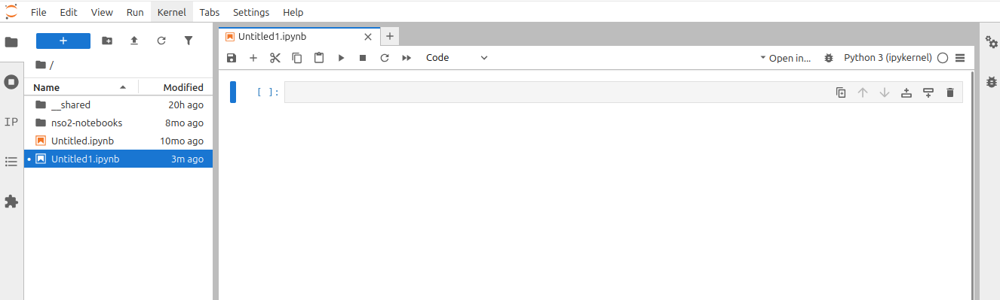

# Einführung

## Organisation

::: columns
::: {.column width="60%"}
- Vorlesung und Übung
  - [Alexander Tismer](https://www.ihs.uni-stuttgart.de/institut/team/Tismer/){target="_blank"}

- Sprechstunde 
  - Termine nach Vereinbarung

- BSL mündlich 20 Minuten
  - Termine nach Vereinbarung
:::

::: {.column width="40%"}
{fig-align="right"}
:::
:::

## Konzept

- Konzept der Vorlesung: 
  [Flip-the-classroom](https://www.fliptheclassroom.de){preview-link="true"}
  @www_fliptheclassroom
- Erarbeitung der Grundlagen erfolgt mit den vorbereiteten Videos zu Hause
  - Der Stoff für eine Einheit wird spätestens eine Woche vorher zur Verfügung 
    gestellt
- Im Präsenztermin diskutieren wir __Ihre__ Probleme gemeinsam
  - Keine Wiederholung des Stoffes
  - Keine Präsenz-Pflicht
- Alle Materialien zum erfolgreichen Bestehen der BSL sind online

## Konzept
### Vorgehensmöglichkeiten

Zu jeder Vorlesung gibt es eine Übung. Sie können daher den Stoff auf 
unterschiedlichen Wegen erarbeiten:

**Vorlesungs-basiert**

  1. Vorlesung durcharbeiten
  2. Bearbeitung der Übung

**Übungs-basiert**

  1. Bearbeitung der Übung bis Sie nicht mehr weiter kommen
  2. Einen Teil der Vorlesung bearbeiten
  3. Mit Übung fortfahren
  4. Weiter bei (2.)

## Zeitplan

:::columns
::: {.column}

| Vorlesung                                                        |     |
|-----------------------------------------------------------------:|:---:|
| Einführung                                                       | 1   |
| FVM und Randbedingungen                                          | 2   |
| Python und FiPy                                                  | 3   |
| Löser                                                            | 4   |
| Numerische Lösung der  inkompressiblen Navier-Stokes-Gleichungen | 5/6 |
| Parallele Optimierung und Sensitivitätsanalyse                   | 7   |

:::
::: {.column}

| Übung                                                            |     |
|-----------------------------------------------------------------:|:---:|
| Eindimensionale Konvektion-Diffusion                             | 1   |
| Löser                                                            | 2   |
| SIMPLE-Verfahren                                                 | 3/4 |
| Optimierung                                                      | 5   |

:::
:::

6 Vorlesungen in 7 x 90 Minuten und 4 Übungen in 5 x 90 Minuten

## Inhalt

:::columns
::: {.column}
{fig-align="left"}
:::
::: {.column}
**Vorlesung**

- Kurze Wiederholung der Finite-Volumen-Methode 
- Behandlung von Rändern im Berechnungsgebiet
- Diskretisierung von Dirichlet und Neumann Randbedingungen

**Übung**

- Lösung 1D-Konvektion-Diffusion
:::
:::

## Inhalt

:::columns
::: {.column}
{}
:::
::: {.column}
**Vorlesung**

- Unterscheidung direkte und indirekte Verfahren
- Einführung in iterative Gleichungslöser
  - Splitting-Verfahren
  - Gradientenverfahren
- Bedingungen für Konvergenz

**Übung**

- Programmierung ausgewählter Verfahren
:::
:::

## Inhalt

::::columns
::: {.column}
{}
:::
::: {.column}
**Vorlesung**

- Probleme beim Lösen der inkompressiblen Navier-Stokes-Gleichungen 
  (Sattelpunktprobleme)
- Theoretische Herleitung des SIMPLE-Verfahrens

**Übung**

- Programmierung des SIMPLE-Verfahrens
- Lösung einer Hohlraumströmung (*Cavity-Flow*)
:::
::::

## Inhalt

:::columns
::: {.column}
{}
:::
::: {.column}
**Vorlesung**

- Parallele Optimierung
- Grundlagen für eine Multi-Deme-Parallelisierung

**Übung**

- Vergleich zwischen serieller und paralleler Optimierung
:::
:::

## Inhalt

:::columns
::: {.column}
{}
:::
::: {.column}
**Vorlesung**

- Beschreibung Sensitivitätsanalyse
- Morris-Methode zur effizienten Untersuchung von Systemen mit vielen 
  Unbekannten

:::
:::

## Vorraussetzungen
### Was sollten Sie mitbingen?
- Freude an der Numerik
  
  **Ideal**: Numerische Strömungsmechanik mit Optimierungsanwendung 1 gehört

- Keine starken Abneigungen gegen Integrale, Matrizen, Vektoren, 
  Differentialgleichungen, ...

- Spaß am Programmieren

  **Ideal**: Kenntnisse in Python oder einer anderen objekt-orientierten 
  Sprache und Erfahrungen mit "open-source"

- Bereitschaft Rückmeldung zu geben und die Veranstaltung aktiv mitzugestalten


## Vorraussetzungen
### Was brauchen Sie?
- Browser 
- www

### Welche Hilfsmittel werden verwendet?
- Python (Versionen 3.6, 3.7 oder 3.12) {height="40"}
- FiPy @www_fipy {height="40"}
- Jupyter @www_jupyter {height="40"}
- Conceptboard zur Vorlesung

**Optionale Zusatzliteratur:** @Moukalled_2016, @Weicker_2015, @Ferziger_2020 
und @Versteeg_2007

## Conceptboard

{fig-align="center" .r-stretch}

- Link zum Board finden Sie auf der Kursseite
- Durch einen Klick auf *Abschnitte* gelangen Sie zu den Unterlagen der 
  jeweiligen Vorlesung

## Conceptboard

Zum Beispiel zur Einheit *Finite-Volumen-Methode und Randbedingungen*

{fig-align="center" .r-stretch}

## Conceptboard

{fig-align="center" .r-stretch}

- Durch die Kommentarfunktion können Sie Fragen, Anmerkungen, Kritik, 
  Fehlerkorrekturen, ... in das Board zu den jeweiligen Folien einfügen.
- Bitte kommentieren Sie alles was Ihnen auffällt und wo Sie Dinge nicht 
  verstehen. Es hilft allen anderen Studierenden!
- Das Board dient auch zur Kommunikation zwischen Studierenden. Gerne dürfen 
  Sie auf Kommentare von anderen antworten.

## Conceptboard

{fig-align="center" .r-stretch}

- Jeweils über der Titelfolie einer Einheit befinden sich die Kurzfragen. 
  Gerne können Sie die Fragen durch Kommentare beantworten und gemeinsam 
  diskutieren.

## Jupyterhub
### Anmeldung

{fig-align="center" .r-stretch}

- Der Hub wird vom KIT betrieben; dort können Sie sich mit Ihrem 
  *st123456* Account anmelden. 
- Zur Anmeldung müssen Sie den Benutzername und das Passwort eingeben.

## Jupyterhub
### Startseite

{fig-align="center" .r-stretch}

- Das korrekte Abbild bekommen Sie über den Link in der Kursseite.
- Nachdem das Profil geladen ist, sehen Sie die Startseite.
- Durch einen Klick auf *Python 3* in der Rubrik *Notebook* können Sie ein 
  neues Notebook starten.
- Ein Klick auf *Terminal* startet ein Terminal.

## Jupyterhub
### Das erste Notebook

{fig-align="center" .r-stretch}

- Neben manuellem Speichern wird regelmäßig automatisch gespeichert
- Durch einen Rechtsklick auf den Tab oder den Dateinamen (*Untitled1.ipynb*), 
  kann dieser geändert werden.
- Zellen werden mit Quelltext befüllt und durch `Shift` + `Enter` ausgeführt.

## Jupyterhub
### Der erste Code

Kopieren Sie den folgenden Quelltext in die erste Zelle und führen Sie diese 
mit `Shift` + `Enter` aus:

```python
import matplotlib
%matplotlib ipympl
import matplotlib.pyplot as pyplot
import numpy as np
```

Erstellen Sie ein eindimensionales Datenfeld durch

```python
xx = np.arange(0,20,0.1)
```

und geben Sie den Inhalt durch 

```python
print(xx)
```

auf die Ausgabe aus.

## Jupyterhub
### Die erste Abbildung

Der folgende Quelltext erzeugt die gezeigte Abbildung:

```{python}
import matplotlib
%matplotlib ipympl
import matplotlib.pyplot as plt
import numpy as np
xx = np.arange(0,20,0.1)
plt.figure(1, figsize=[10,3])
plt.plot(xx,np.sqrt(xx), 'k-')
```

## Jupyterhub
### Wie bekomme ich die Notebooks für die Übung?

1. Starten Sie ein *Terminal* auf dem Hub.

2. Repository mit *git* klonen.
   
   ```bash
   cd work && git clone -b move-to-kit https://github.com/atismer/nso2-notebooks.git
   ```

## Jupyterhub
### Wie kann ich mir helfen?

::: panel-tabset
### Code

- Für viele Python-Objekte erhalten Sie durch die Funktion `help` eine 
  Ausgabe, z.B. für den Befehl `plot`:

  ```python
  import matplotlib
  import matplotlib.pyplot as plt
  help(plt.plot)
  ```

- Durch Drücken der Taste *Tabulator* erhalten Sie die Autovervollständigung.

### Ausgabe

```{python}
import matplotlib
import matplotlib.pyplot as plt
help(plt.plot)
```
:::

## Jupyterhub
### Wie kann ich mir helfen?

::: panel-tabset

### Code

Die Ausführung von

```python
plt.plot(xx,np.sqrt(xx), 'kl')
```

erzeugt einen Fehler. 

**Wichtig**: Ruhe bewahren!

Versuchen Sie sich selber zu helfen. Je öfter Sie den Fehler suchen und 
versuchen diesen zu beheben, desto besser werden Sie darin. In der Regel steht
der Fehler ganz unten. Der obere Teil enthält meist ein *Backtrace* und listet
alle bis zum Fehler aufgerufenen Funktionen.

### Ausgabe

```python
---------------------------------------------------------------------------
ValueError                                Traceback (most recent call last)
Cell In[1], line 7
      5 xx = np.arange(0,20,0.1)                                                        
      6 plt.figure(1, figsize=[10,3])                                                   
----> 7 plt.plot(xx,np.sqrt(xx), 'kl')  

File /opt/conda/lib/python3.12/site-packages/matplotlib/pyplot.py:3827, in plot(scalex, scaley, data, *args, **kwargs)
   3819 @_copy_docstring_and_deprecators(Axes.plot)
   3820 def plot(
   3821     *args: float | ArrayLike | str,
   (...)   3825     **kwargs,
   3826 ) -> list[Line2D]:
-> 3827     return gca().plot(
   3828         *args,
   3829         scalex=scalex,
   3830         scaley=scaley,
   3831         **({"data": data} if data is not None else {}),
   3832         **kwargs,
   3833     )

File /opt/conda/lib/python3.12/site-packages/matplotlib/axes/_axes.py:1777, in Axes.plot(self, scalex, scaley, data, *args, **kwargs)
   1534 """
   1535 Plot y versus x as lines and/or markers.
   1536 
   (...)   1774 (``'green'``) or hex strings (``'#008000'``).
   1775 """
   1776 kwargs = cbook.normalize_kwargs(kwargs, mlines.Line2D)
-> 1777 lines = [*self._get_lines(self, *args, data=data, **kwargs)]
   1778 for line in lines:
   1779     self.add_line(line)

File /opt/conda/lib/python3.12/site-packages/matplotlib/axes/_base.py:297, in _process_plot_var_args.__call__(self, axes, data, return_kwargs, *args, **kwargs)
    295     this += args[0],
    296     args = args[1:]
--> 297 yield from self._plot_args(
    298     axes, this, kwargs, ambiguous_fmt_datakey=ambiguous_fmt_datakey,
    299     return_kwargs=return_kwargs
    300 )

File /opt/conda/lib/python3.12/site-packages/matplotlib/axes/_base.py:444, in _process_plot_var_args._plot_args(self, axes, tup, kwargs, return_kwargs, ambiguous_fmt_datakey)
    441 if len(tup) > 1 and isinstance(tup[-1], str):
    442     # xy is tup with fmt stripped (could still be (y,) only)
    443     *xy, fmt = tup
--> 444     linestyle, marker, color = _process_plot_format(
    445         fmt, ambiguous_fmt_datakey=ambiguous_fmt_datakey)
    446 elif len(tup) == 3:
    447     raise ValueError('third arg must be a format string')

File /opt/conda/lib/python3.12/site-packages/matplotlib/axes/_base.py:192, in _process_plot_format(fmt, ambiguous_fmt_datakey)
    190         i += len(cn_color[0])
    191     else:
--> 192         raise ValueError(errfmt.format(fmt, f"unrecognized character {c!r}"))
    194 if linestyle is None and marker is None:
    195     linestyle = mpl.rcParams['lines.linestyle']

ValueError: 'kl' is not a valid format string (unrecognized character 'l')
```

:::

## Referenzen

::: {#refs}
:::
